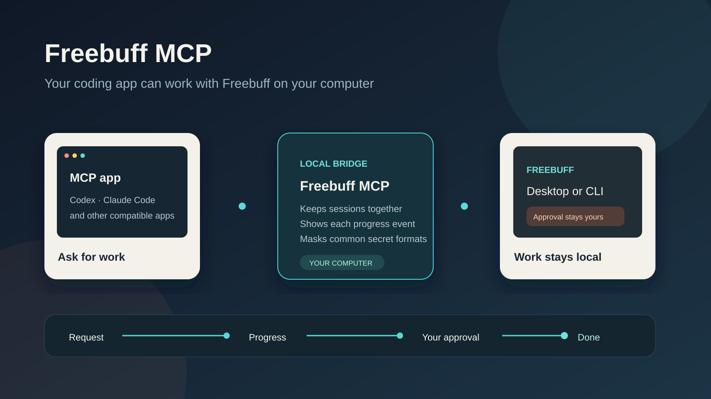
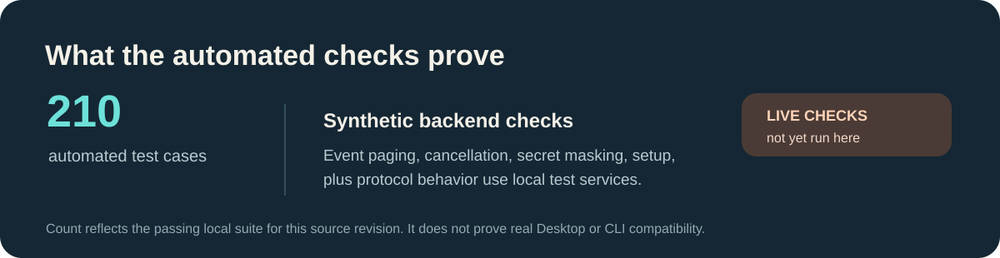

# Freebuff MCP



Watch the [short video](docs/media/freebuff-mcp-explainer.mp4) to see the path from request to finished work.

Freebuff MCP lets Codex, Claude Code, plus other MCP apps work with Freebuff Desktop plus its command line app on your computer. It can find projects, read threads, send a request, show progress, read ordinary project files, plus stop work when the app asks.

MCP is a shared way AI apps connect to tools on your computer.

Your computer runs the bridge. Your Freebuff installation controls access to your projects. The bridge does not read process memory. It does not remove Freebuff approval steps. Text returned to an MCP app has common secret patterns masked. Pattern checks can miss unusual secrets. Do not treat them as a complete security boundary.

## Start here

Node.js 20 is the minimum. Install Freebuff Desktop. The command line app works too. Sign in before connecting an MCP app.

```sh
npm install --global freebuff-mcp
freebuff-mcp doctor
```

The doctor report shows whether Desktop is found, whether it allows changes, whether the command line app is available, plus whether its terminal component works. A found app can still be signed out. A missing terminal component can block command line sessions. Check the report before setting up an MCP app.

## Connect an MCP app

Codex setup prints its settings entry.

```sh
freebuff-mcp install codex
```

Claude Code setup prints its instructions.

```sh
freebuff-mcp install claude
```

The automatic write option adds the entry to your app settings. It preserves other settings. It refuses to replace a different Freebuff entry.

## What you can ask it to do

The bridge can find projects plus threads, read thread messages, start a request, continue earlier work, show live progress, stop a turn, resume a paused thread, change model settings, inspect changed files, read project files, plus list attachments.

`run_turn` stays open while Freebuff works. It reports progress while the turn runs. When the MCP app cancels the request, the bridge asks the owning Freebuff backend to stop. A local cancel alone does not prove the work stopped.

Freebuff can ask you to approve a step. The turn stays marked as waiting. Resume checks the same thread. The bridge marks the turn complete only after Desktop confirms a finish. Use `stop_turn` to stop a waiting turn. Command line resume may not prove that the original work finished. The bridge keeps that turn open when its result is uncertain.

Progress arrives in pages. Each returned cursor points to the last event in that page. Use it to read the next page without skipping events. Page size is limited to keep replies manageable.

## Local connection plus remote connection

The default connection uses standard input plus output. This works well when your MCP app runs on the same computer.

An optional remote web connection is available through Streamable HTTP.

```sh
freebuff-mcp serve-http
```

It listens on `127.0.0.1` port `8788`. Requests need the token in `FREEBUFF_MCP_TOKEN`. Remote binding also needs `FREEBUFF_MCP_ALLOW_REMOTE=1`. Remote use needs trusted HTTPS. A private network also works. Keep the access token private. The remote server still needs access to Freebuff on the computer where the bridge runs.

ACP is another tool connection format. This project's ACP support is experimental. Use MCP to do normal work.

## When a connection fails

Run the doctor first. Desktop can be visible while change access remains unavailable. Restart Freebuff Desktop, reopen the project, then run the doctor again if its permission is missing. Check that the command line app is installed plus signed in if Desktop cannot accept changes. Managed command line sessions need the terminal component.

## Security plus privacy

File reads stay inside the selected project. Credential files are denied. Binary content is denied. Reads stop at one megabyte. Common passwords, access tokens, authorization headers, URLs, plus private key text are masked before they reach the AI app. Fields named password, token, secret, API key are masked too. No text pattern can find every possible secret. Review sensitive project data before sharing it with a model.

Read [the security notes](SECURITY.md) plus [the privacy notes](PRIVACY.md) before using the bridge with private work.

## Project health



The figures above come from the local suite run on this source revision. They describe automated checks. They do not prove live compatibility with every Freebuff version. The Desktop plus command line acceptance steps are in [the acceptance checklist](docs/acceptance_checklist.md).

## Build from source

```sh
pnpm install --frozen-lockfile
pnpm typecheck
pnpm test
pnpm build
```

The automated suite uses fake Desktop plus command line services. It checks protocol behavior, event paging, cancellation, redaction, setup, plus error handling. It cannot prove that a signed in installation works on your computer. Use the acceptance checklist to record that separately.

## Learn more

Read [the changelog](CHANGELOG.md) to see release history. Read [the license](LICENSE) before you share changes to this project.
