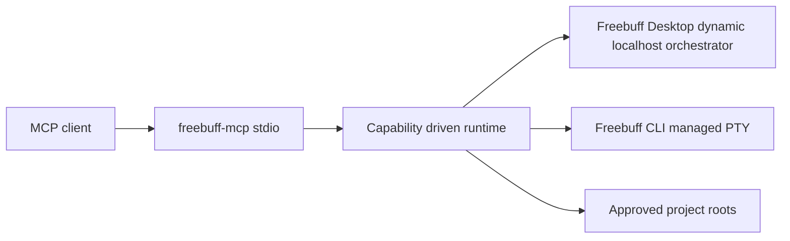

# Architecture

The MCP layer depends on a small runtime interface. Desktop discovery reads dynamic localhost ports from platform-specific Freebuff logs and probes `/api/projects`; there is no fixed fallback port. By default the bridge prefers a responding Desktop orchestrator, then falls back to the installed CLI PTY. CLI history is read from Freebuff's local chat store, and project reads are canonicalized and confined to the configured project root. Desktop mutation calls remain read-only unless a verified Freebuff authorization contract is available.

The community bridge was a research lead, not a dependency. Its repository had no license file, so this project contains independent code.

