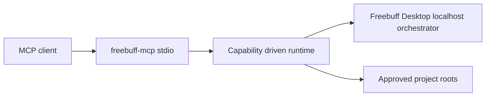

# Architecture

The MCP layer depends on a small runtime interface. `DesktopOrchestratorRuntime` probes the local `/v1/info` endpoint and validates every response as untrusted data. Read tools include project and thread discovery plus confined file reads. Write tools are available only when the orchestrator is detected.

The community bridge was a research lead, not a dependency. Its repository had no license file, so this project contains independent code.

